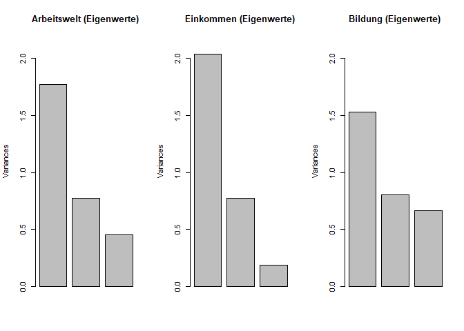
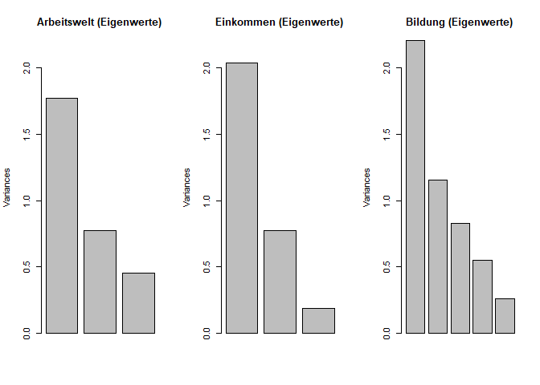
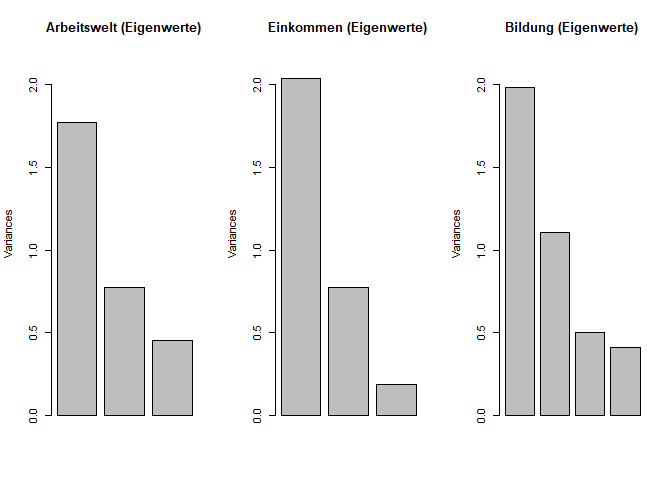
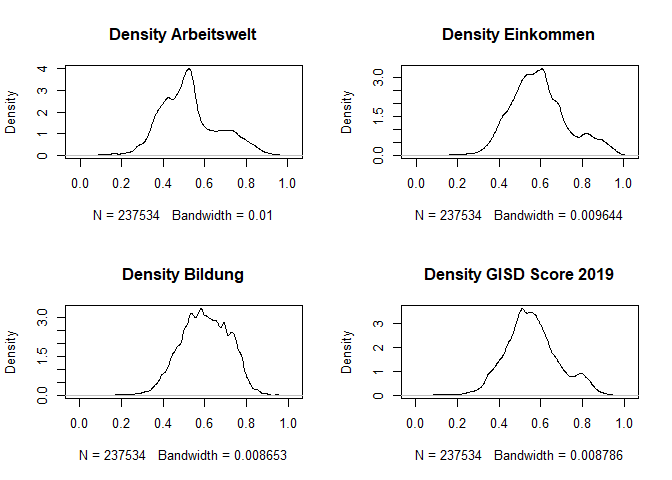

# Info

In diesem Codeblog analysieren wir die Faktorenanalyse des GISD. 


```r
library(tidyverse) # Tidyverse Methods
library(bookdown) 
library(readxl) # Read Excel
library(pastecs) # descriptive stats
library(knitr)
library(ggplot2)

home <- getwd()
setwd(home)

Impdata.imputed <- readRDS("Outfiles/Impdata_check_2019.rds")
```


```r
# Variablenliste für die Faktorenanalyse 
#print(listofdeterminants)

TS_Arbeitswelt <- Impdata.imputed  %>% ungroup() %>% 
  select(Beschaeftigtenquote_adj,Arbeitslosigkeit,Bruttoverdienst_ln)

TS_Einkommen   <- Impdata.imputed %>% select(Einkommensteuer_ln,Haushaltseinkommen_ln,Schuldnerquote) 
# Für den Vergleich der Ergebnisse wird zunächst ein Datensatz für die Variablenauswahl der Revision 2019 generiert

TS_Bildung <- Impdata.imputed %>% select(BeschaeftigtemitakadAbschluss,BeschaeftigteohneAbschluss_adj,SchulabgaengerohneAbschluss_adj)

# Check dieser Lösung für das 2014er Sample 
#TS_Bildung_r2014 <- Impdata.imputed %>% filter(Jahr<2015) %>%  #dplyr::select(BeschaeftigtemitakadAbschluss,BeschaeftigteohneAbschluss,SchulabgaengerohneAbschluss) 

TS_Bildung_4items <- Impdata.imputed %>% select(BeschaeftigtemitakadAbschluss,BeschaeftigteohneAbschluss_adj,SchulabgaengerohneAbschluss_adj, SchulabgaengermitHochschulreife_adj)

#TS_Bildung_4items_without_BoA <- Impdata.imputed %>% #dplyr::select(BeschaeftigtemitakadAbschluss,SchulabgaengerohneAbschluss, SchulabgaengermitHochschulreife) 
```

# Verschiedene Faktorenanalysen des GISD {.tabset}


## Faktorenanalyse gepoolte Querschnitte

Es werden Hauptkomponentenanalysen für jede der drei Subskalen auf Basis der imputierten Daten geschätzt. 


```r
# PCA für die Arbeitsweltdimension
#TS_Arbeitswelt.pca <- prcomp(TS_Arbeitswelt, center = TRUE, scale. = TRUE, retx=TRUE)
#TS_Arbeitswelt.pca
	# Option retx erzeugt rotierte Lösung

TS_Arbeitswelt.pca <- prcomp(TS_Arbeitswelt, center = TRUE, scale. = TRUE, retx=TRUE, rank. = 1)
# die Option rank erlaubt die Beschränkung der Anzahl an Komponenten (Faktoren)
#TS_Arbeitswelt.pca
# nur die erste Komponente mit Eigenwert über 1
	# (prcomp gibt standardmäßig Sdev statt Varianz aus)
#plot(TS_Arbeitswelt.pca, main = "Varianz der Faktoren für Arbeitswelt")

	# screeplot - bei nur drei Variablen wird ein Balkendiagramm angezeigt
# die Faktorladungen der drei Hauptkomponenten für Arbeitswelt 
# die Ladungen der ersten Komponente enstprechen der Erwartung


# PCA für die Einkommensdimension
#TS_Einkommen.pca <- prcomp(TS_Einkommen, center = TRUE, scale. = TRUE, retx=TRUE) 
#plot(TS_Einkommen.pca)
TS_Einkommen.pca <- prcomp(TS_Einkommen, center = TRUE, scale. = TRUE, retx=TRUE, rank. = 1) 
#TS_Einkommen.pca


# PCA für die Bildungsdimension
#TS_Bildung.pca <- prcomp(TS_Bildung, center = TRUE, scale. = TRUE, retx=TRUE) 
#plot(TS_Bildung.pca)
TS_Bildung.pca <- prcomp(TS_Bildung, center = TRUE, scale. = TRUE, retx=TRUE, rank. = 1) 
#TS_Bildung.pca

# Alternativ Bildungskomponente mit BeschaeftigtemitakadAbschluss,SchulabgaengermitHochschulreife,SchulabgaengerohneAbschluss
#TS_Bildung_new.pca <- prcomp(TS_Bildung_4items_without_BoA, center = TRUE, scale. = TRUE, retx=TRUE, rank. = 1) 

# für die Bildung deutet die Analyse eher auf zwei Komponenten hin
# die Faktorladung für SchulabgaengerohneAbschluss ist auf dem zweiten Faktor schwach
# es wird die Komponente ausgewählt, bei der Beschaeftigte mit akad Abschluss positiv korreliert und 
# BeschaeftigteohneAbschluss und SchulabgaengerohneAbschluss negativ
# regionale Deprivation als Merkmal geringer Anteile von Akademikern bei gleichzeitigen hohen Anteilen 
# von Beschaeftigten ohne Abschluss und Schulabgaengern ohne Abschluss


# Check der Bildungskomponente in Revision 2018 (Daten für 2014)
#TS_Bildung_r2014.pca <- prcomp(TS_Bildung_r2014, center = TRUE, scale. = TRUE, retx=TRUE) 
#TS_Bildung_r2014.pca
# 
TS_Bildung_4items.pca <- prcomp(TS_Bildung_4items, center = TRUE, scale. = TRUE, retx=TRUE, rank. =1 )
# plot(TS_Bildung_4items.pca)
# TS_Bildung_4items.pca

#tab_Bildung_4items <- cbind("Faktor" = "F", "SD" = TS_Bildung_4items.pca$sdev^2)
#tab_Bildung_4items <- cbind(as.data.frame(tab_Bildung_4items))
#tab_Bildung_4items$Faktor <- c("Faktor 1", "Faktor 2", "Faktor 3")
#colnames(tab_Bildung_4items) <- c("Faktoren für Bildung", "Varianz")
```

### Eigenwerte der Komponenten


```r
par(mfrow=c(1, 3))
plot(TS_Arbeitswelt.pca, main = "Arbeitswelt (Eigenvektoren)", ylim=c(0,2.2))
plot(TS_Einkommen.pca, main = "Einkommen (Eigenvektoren)", ylim=c(0,2.2))
plot(TS_Bildung.pca, main = "Bildung (Eigenvektoren)", ylim=c(0,2.2))
```

<!-- -->


```r
Varianz_tab <- cbind("F_A" = "Faktor1", "Var_A" = round(TS_Arbeitswelt.pca$sdev^2, digits = 3), "Var_E" = round(TS_Einkommen.pca$sdev^2, digits = 3),  "Var_B" = round(TS_Bildung.pca$sdev^2, digits = 3))

Varianz_tab <- cbind(as.data.frame(Varianz_tab))

Varianz_tab$F_A <- c("Faktor 1", "Faktor 2", "Faktor 3")

colnames(Varianz_tab) <- c("Faktoren", "Varianz Arbeitswelt", "Varianz Einkommen", "Varianz Bildung")

kable(Varianz_tab, caption = "Varianz der Faktoren (Eigenvektoren)")
```


Table: (\#tab:unnamed-chunk-2)Varianz der Faktoren (Eigenvektoren)

|Faktoren |Varianz Arbeitswelt |Varianz Einkommen |Varianz Bildung |
|:--------|:-------------------|:-----------------|:---------------|
|Faktor 1 |1.482               |2.068             |1.943           |
|Faktor 2 |0.963               |0.748             |0.704           |
|Faktor 3 |0.556               |0.183             |0.353           |

Die PCA zeigt drei Hauptkomponenten für die Dimension Arbeitswelt. Nur die erste Komponente hat einen Eigenwert über eins. Die Faktorladungen der drei Variablen (Beschäftigungsquote, Arbeitslosigkeit und Bruttoverdienst) entsprechen dabei den Ertwartungen.

Die PCA zeigt drei Hauptkomponenten für die Dimension Einkommen. Nur die erste Komponente hat einen Eigenwert über zwei. Die Faktorladungen der drei Variablen (Einkommensteuer, Haushaltseinkommen und Schuldnerquote) entsprechen dabei den Erwartungen.

Die PCA zeigt  drei Hauptkomponenten für die Dimension Bildung. Sowohl die erste als auch die zweite Komponente haben dabei einen Eigenwert über eins. Die Faktorladungen der drei Variablen (Beschäftigte mit akad. Abschluss, Beschäftigte ohne Abschlus und Schulabgänger ohne Abschluss) entsprechen somit nicht den Erwartungen.

Fazit: Die Betrachtung der Eigenwerte weist bei der Bildungsdimension auf zwei Hauptkomponenten hin.
Hier sollte eine detailliertere Analyse folgen. 

### Faktorladungen


```r
# Componentoverview

GISD_Komponents <- cbind("Teildimension"="Arbeitswelt","Faktorladung"=round((TS_Arbeitswelt.pca$rotation*sqrt(abs(TS_Arbeitswelt.pca$sdev[1]^2))), digits = 3),"Component"=round(TS_Arbeitswelt.pca$rotation, digits = 3))
#cbind erstellt Spaltenvektoren mit den Infos aus Teildimension, den (rotierten) Faktorladungen und den Components

GISD_Komponents <- rbind(GISD_Komponents,cbind("Teildimension"="Einkommen","Faktorladung"=round((TS_Einkommen.pca$rotation*sqrt(abs(TS_Einkommen.pca$sdev[1]^2))), digits = 3),"Component"=round(TS_Einkommen.pca$rotation, digits = 3)))
# rbind erstellt Zeilenvektoren, diese werden hier in die bereits vorhandenen Spaltenvektoren eingebunden

GISD_Komponents <- rbind(GISD_Komponents,cbind("Teildimension"="Bildung","Faktorladung"=round((TS_Bildung.pca$rotation*sqrt(abs(TS_Bildung.pca$sdev[1]^2))), digits = 3),"Component"=round(TS_Bildung.pca$rotation, digits = 3)))
# auch für die Teildimension Bildung werden Zeilenvektoren eingebunden

GISD_Komponents <- cbind("Variables"=as.data.frame(rownames(GISD_Komponents)),as.data.frame(GISD_Komponents))
# als letztes wird die Matrix in einen Dataframe übersetzt

rownames(GISD_Komponents) <- NULL
# die überflüssigen Zeilennamen werden gestrichen

colnames(GISD_Komponents) <- c("Variable","Dimension","Faktorladung","Component")

GISD_Komponents$prop_dem <- round(as.numeric(GISD_Komponents$Component)^2*100,digits=1)
# eine weitere Spalte Proportion wird eingefügt mit prozentualen Anteilswerten (eine Nachkommastelle)

GISD_Komponents$prop_GISD <- round(as.numeric(GISD_Komponents$prop_dem)/3, digits = 1)

colnames(GISD_Komponents) <- c("Variable","Dimension","Faktorladung","Component", "Anteil Teilscore", "Anteil GISD")

GISD_Komponents$Variable <- c("Beschäftigtenquote (gedeckelt)", "Arbeitslosigkeit", "Bruttoverdienst (log.)", "Einkommensteuer (log.)", "Haushaltseinkommen (log.)", "Schuldnerquote", "Beschäftigte mit akad. Abschluss", "Beschäftigte ohne Abschluss (adj.)", "Schulabgänger ohne Abschluss (adj.)")

kable(GISD_Komponents, caption = "Faktorladungen und Anteile an den Teilscores sowie am Index")
```


Table: (\#tab:unnamed-chunk-3)Faktorladungen und Anteile an den Teilscores sowie am Index

|Variable                            |Dimension   |Faktorladung |Component | Anteil Teilscore| Anteil GISD|
|:-----------------------------------|:-----------|:------------|:---------|----------------:|-----------:|
|Beschäftigtenquote (gedeckelt)      |Arbeitswelt |0.544        |0.447     |             20.0|         6.7|
|Arbeitslosigkeit                    |Arbeitswelt |-0.689       |-0.566    |             32.0|        10.7|
|Bruttoverdienst (log.)              |Arbeitswelt |0.843        |0.693     |             48.0|        16.0|
|Einkommensteuer (log.)              |Einkommen   |0.911        |0.633     |             40.1|        13.4|
|Haushaltseinkommen (log.)           |Einkommen   |0.919        |0.639     |             40.8|        13.6|
|Schuldnerquote                      |Einkommen   |-0.628       |-0.437    |             19.1|         6.4|
|Beschäftigte mit akad. Abschluss    |Bildung     |0.868        |0.623     |             38.8|        12.9|
|Beschäftigte ohne Abschluss (adj.)  |Bildung     |0.85         |0.61      |             37.2|        12.4|
|Schulabgänger ohne Abschluss (adj.) |Bildung     |-0.683       |-0.49     |             24.0|         8.0|


## Faktorenanalyse (4 Items Bildung)
gepoolte Querschnitte (4 Items Bildung)

### Eigenwerte der Komponenten

```r
par(mfrow=c(1, 3))
plot(TS_Arbeitswelt.pca, main = "Arbeitswelt (Eigenvektoren)", ylim=c(0,2.2))
plot(TS_Einkommen.pca, main = "Einkommen (Eigenvektoren)", ylim=c(0,2.2))
plot(TS_Bildung_4items.pca, main = "Bildung (Eigenvektoren)", ylim=c(0,2.2))
```

<!-- -->


```r
Varianz_B4_tab <- cbind("F_A" = "Faktor1", "Var_A" = round(TS_Arbeitswelt.pca$sdev^2, digits = 3), "Var_E" = round(TS_Einkommen.pca$sdev^2, digits = 3),  "Var_B" = round(TS_Bildung_4items.pca$sdev^2, digits = 3))

Varianz_B4_tab[4,2] = NA
Varianz_B4_tab[4,3] = NA

Varianz_B4_tab <- cbind(as.data.frame(Varianz_B4_tab))

Varianz_B4_tab$F_A <- c("Faktor 1", "Faktor 2", "Faktor 3", "Faktor 4")

colnames(Varianz_B4_tab) <- c("Faktoren", "Varianz Arbeitswelt", "Varianz Einkommen", "Varianz Bildung")

kable(Varianz_B4_tab, caption = "Varianz der Faktoren (Eigenvektoren)")
```


Table: (\#tab:unnamed-chunk-5)Varianz der Faktoren (Eigenvektoren)

|Faktoren |Varianz Arbeitswelt |Varianz Einkommen |Varianz Bildung |
|:--------|:-------------------|:-----------------|:---------------|
|Faktor 1 |1.482               |2.068             |2.368           |
|Faktor 2 |0.963               |0.748             |0.819           |
|Faktor 3 |0.556               |0.183             |0.494           |
|Faktor 4 |NA                  |NA                |0.318           |

### Faktorladungen


```r
# Componentoverview
GISD_Komponents_4 <- cbind("Teildimension"="Arbeitswelt","Faktorladung"=round((TS_Arbeitswelt.pca$rotation*sqrt(abs(TS_Arbeitswelt.pca$sdev[1]^2))), digits = 3),"Component"=round(TS_Arbeitswelt.pca$rotation, digits = 3))
#cbind erstellt Spaltenvektoren mit den Infos aus Teildimension, den (rotierten) Faktorladungen und den Components

GISD_Komponents_4 <- rbind(GISD_Komponents_4,cbind("Teildimension"="Einkommen","Faktorladung"=round((TS_Einkommen.pca$rotation*sqrt(abs(TS_Einkommen.pca$sdev[1]^2))), digits = 3),"Component"=round(TS_Einkommen.pca$rotation, digits = 3)))
# rbind erstellt Zeilenvektoren, diese werden hier in die bereits vorhandenen Spaltenvektoren eingebunden

GISD_Komponents_4 <- rbind(GISD_Komponents_4,cbind("Teildimension"="Bildung","Faktorladung"=round((TS_Bildung_4items.pca$rotation[1:4,1]*sqrt(abs(TS_Bildung_4items.pca$sdev[1]^2))), digits = 3),"Component"=round(TS_Bildung_4items.pca$rotation[1:4,1], digits = 3)))
# auch für die Teildimension Bildung werden Zeilenvektoren eingebunden

GISD_Komponents_4 <- cbind("Variables"=as.data.frame(rownames(GISD_Komponents_4)),as.data.frame(GISD_Komponents_4))
# als letztes wird die Matrix in einen Dataframe übersetzt

rownames(GISD_Komponents_4) <- NULL
# die überflüssigen Zeilennamen werden gestrichen

colnames(GISD_Komponents_4) <- c("Variable","Dimension","Faktorladung","Component")

GISD_Komponents_4$prop_dem <- round(as.numeric(GISD_Komponents_4$Component)^2*100,digits=1)
# eine weitere Spalte Proportion wird eingefügt mit prozentualen Anteilswerten (eine Nachkommastelle)

GISD_Komponents_4$prop_GISD <- round(as.numeric(GISD_Komponents_4$prop_dem)/3, digits = 1)

colnames(GISD_Komponents_4) <- c("Variable","Dimension","Faktorladung","Component", "Anteil Teilscore", "Anteil GISD")

GISD_Komponents_4$Variable <- c("Beschäftigtenquote (gedeckelt)", "Arbeitslosigkeit", "Bruttoverdienst (log.)", "Einkommensteuer (log.)", "Haushaltseinkommen (log.)", "Schuldnerquote", "Beschäftigte mit akad. Abschluss", "Beschäftigte ohne Abschluss (adj.)", "Schulabgänger ohne Abschluss (adj.)", "Schulabgänger mit Hochschulreife (adj.)")

kable(GISD_Komponents_4, caption = "Faktorladungen und Anteile an den Teilscores sowie am Index")
```


Table: (\#tab:unnamed-chunk-6)Faktorladungen und Anteile an den Teilscores sowie am Index

|Variable                                |Dimension   |Faktorladung |Component | Anteil Teilscore| Anteil GISD|
|:---------------------------------------|:-----------|:------------|:---------|----------------:|-----------:|
|Beschäftigtenquote (gedeckelt)          |Arbeitswelt |0.544        |0.447     |             20.0|         6.7|
|Arbeitslosigkeit                        |Arbeitswelt |-0.689       |-0.566    |             32.0|        10.7|
|Bruttoverdienst (log.)                  |Arbeitswelt |0.843        |0.693     |             48.0|        16.0|
|Einkommensteuer (log.)                  |Einkommen   |0.911        |0.633     |             40.1|        13.4|
|Haushaltseinkommen (log.)               |Einkommen   |0.919        |0.639     |             40.8|        13.6|
|Schuldnerquote                          |Einkommen   |-0.628       |-0.437    |             19.1|         6.4|
|Beschäftigte mit akad. Abschluss        |Bildung     |0.883        |0.574     |             32.9|        11.0|
|Beschäftigte ohne Abschluss (adj.)      |Bildung     |0.827        |0.538     |             28.9|         9.6|
|Schulabgänger ohne Abschluss (adj.)     |Bildung     |-0.579       |-0.376    |             14.1|         4.7|
|Schulabgänger mit Hochschulreife (adj.) |Bildung     |0.753        |0.49      |             24.0|         8.0|


## Faktorenanalyse nur für Daten des Jahres 2019

Es werden Hauptkomponentenanalysen für jede der drei Subskalen auf Basis der imputierten Daten geschätzt, hier nur mit den Daten von 2019.


```r
# Variablenliste für die Faktorenanalyse mit Einschränkung 2017 

TS_Arbeitswelt_19 <- Impdata.imputed  %>% filter(Jahr == 2019) %>% ungroup() %>% dplyr::select(Beschaeftigtenquote_adj,Arbeitslosigkeit,Bruttoverdienst_ln) 

TS_Einkommen_19   <- Impdata.imputed %>% filter(Jahr == 2019) %>% dplyr::select(Einkommensteuer_ln,Haushaltseinkommen_ln,Schuldnerquote) 

TS_Bildung_19 <- Impdata.imputed %>% filter(Jahr == 2019) %>% dplyr::select(BeschaeftigtemitakadAbschluss,BeschaeftigteohneAbschluss_adj,SchulabgaengerohneAbschluss_adj)


#PCA Arbeitswelt 2017
TS_Arbeitswelt_19.pca <- prcomp(TS_Arbeitswelt_19, center = TRUE, scale. = TRUE, retx=TRUE, rank. = 1)


#PCA Einkommen 2017
TS_Einkommen_19.pca <- prcomp(TS_Einkommen_19, center = TRUE, scale. = TRUE, retx=TRUE, rank. = 1)


#PCA Bildung 2017
TS_Bildung_19.pca <- prcomp(TS_Bildung_19, center = TRUE, scale. = TRUE, retx=TRUE, rank. =1 ) 
```

### Eigenwerte der Komponenten


```r
par(mfrow=c(1, 3))
plot(TS_Arbeitswelt_19.pca, main = "Arbeitswelt (Eigenvektoren)", ylim=c(0,2))
plot(TS_Einkommen_19.pca, main = "Einkommen (Eigenvektoren)", ylim=c(0,2))
plot(TS_Bildung_19.pca, main = "Bildung (Eigenvektoren)", ylim=c(0,2))
```

<!-- -->


```r
Varianz19_tab <- cbind("F_A" = "Faktor1", "Var_A" = round(TS_Arbeitswelt_19.pca$sdev^2, digits = 3), "Var_E" = round(TS_Einkommen_19.pca$sdev^2, digits = 3), "Var_B" = round(TS_Bildung_19.pca$sdev^2, digits = 3))

Varianz19_tab <- cbind(as.data.frame(Varianz19_tab))

Varianz19_tab$F_A <- c("Faktor 1", "Faktor 2", "Faktor 3")


colnames(Varianz19_tab) <- c("Faktoren", "Varianz Arbeitswelt", "Varianz Einkommen", "Varianz Bildung")

kable(Varianz19_tab, caption = "Varianz der Faktoren (Eigenvektoren) für 2017")
```


Table: (\#tab:unnamed-chunk-8)Varianz der Faktoren (Eigenvektoren) für 2017

|Faktoren |Varianz Arbeitswelt |Varianz Einkommen |Varianz Bildung |
|:--------|:-------------------|:-----------------|:---------------|
|Faktor 1 |1.455               |2.165             |1.321           |
|Faktor 2 |1.056               |0.619             |1.007           |
|Faktor 3 |0.489               |0.217             |0.672           |

### Faktorladungen


```r
# Componentoverview 2017
GISD_Komponents_19 <- cbind("Teildimension"="Arbeitswelt","Faktorladung"=round((TS_Arbeitswelt_19.pca$rotation*sqrt(abs(TS_Arbeitswelt_19.pca$sdev[1]^2))), digits = 3),"Component"=round(TS_Arbeitswelt_19.pca$rotation, digits = 3))
# cbind erstellt Spaltenvektoren mit den Infos aus Teildimension, den (rotierten) Faktorladungen und den Components

GISD_Komponents_19 <- rbind(GISD_Komponents_19,cbind("Teildimension"="Einkommen","Faktorladung"=round((TS_Einkommen_19.pca$rotation*sqrt(abs(TS_Einkommen_19.pca$sdev[1]^2))), digits = 3),"Component"=round(TS_Einkommen_19.pca$rotation, digits = 3)))
# rbind erstellt Zeilenvektoren, diese werden hier in die bereits vorhandenen Spaltenvektoren eingebunden

GISD_Komponents_19 <- rbind(GISD_Komponents_19,cbind("Teildimension"="Bildung","Faktorladung"=round((TS_Bildung_19.pca$rotation*sqrt(abs(TS_Bildung_19.pca$sdev[1]^2))), digits = 3),"Component"=round(TS_Bildung_19.pca$rotation, digits = 3)))
# auch für die Teildimension Bildung werden Zeilenvektoren eingebunden

GISD_Komponents_19 <- cbind("Variables"=as.data.frame(rownames(GISD_Komponents_19)),as.data.frame(GISD_Komponents_19))
# als letztes wird die Matrix in einen Dataframe übersetzt

rownames(GISD_Komponents_19) <- NULL
# die überflüssigen Zeilennamen werden gestrichen

colnames(GISD_Komponents_19) <- c("Variable","Dimension","Faktorladung","Component")

GISD_Komponents_19$prop_dem <- round(as.numeric(GISD_Komponents_19$Component)^2*100,digits=1)
# eine weitere Spalte Proportion wird eingef|gt mit prozentualen Anteilswerten (eine Nachkommastelle)

GISD_Komponents_19$prop_GISD <- round(as.numeric(GISD_Komponents_19$prop_dem)/3, digits = 1)

colnames(GISD_Komponents_19) <- c("Variable","Dimension","Faktorladung","Coponent", "Anteil Dimension", "Anteil GISD")

GISD_Komponents_19$Variable <- c("Beschäftigtenquote (gedeckelt)", "Arbeitslosigkeit", "Bruttoverdienst (log.)", "Einkommensteuer (log.)", "Haushaltseinkommen (log.)", "Schuldnerquote", "Beschäftigte mit akad. Abschluss", "Beschäftigte ohne Abschluss (adj.)", "Schulabgänger ohne Abschluss (adj.)")

kable(GISD_Komponents_19, caption = "Komponenten und Anteile der Dimensionen für 2017")
```


Table: (\#tab:unnamed-chunk-9)Komponenten und Anteile der Dimensionen für 2017

|Variable                            |Dimension   |Faktorladung |Coponent | Anteil Dimension| Anteil GISD|
|:-----------------------------------|:-----------|:------------|:--------|----------------:|-----------:|
|Beschäftigtenquote (gedeckelt)      |Arbeitswelt |0.285        |0.237    |              5.6|         1.9|
|Arbeitslosigkeit                    |Arbeitswelt |0.873        |0.724    |             52.4|        17.5|
|Bruttoverdienst (log.)              |Arbeitswelt |-0.782       |-0.648   |             42.0|        14.0|
|Einkommensteuer (log.)              |Einkommen   |0.898        |0.61     |             37.2|        12.4|
|Haushaltseinkommen (log.)           |Einkommen   |0.908        |0.617    |             38.1|        12.7|
|Schuldnerquote                      |Einkommen   |-0.731       |-0.497   |             24.7|         8.2|
|Beschäftigte mit akad. Abschluss    |Bildung     |-0.806       |-0.701   |             49.1|        16.4|
|Beschäftigte ohne Abschluss (adj.)  |Bildung     |-0.086       |-0.075   |              0.6|         0.2|
|Schulabgänger ohne Abschluss (adj.) |Bildung     |0.816        |0.709    |             50.3|        16.8|


# Generierung des Faktorscores auf Basis 2019

```r
TS_Bildung_4items.pca <- prcomp(TS_Bildung_4items, center = TRUE, scale. = TRUE, retx=TRUE, rank. = 1)

Resultdataset <- Impdata.imputed
Resultdataset$TS_Arbeitswelt_19 <- as.numeric(predict(TS_Arbeitswelt_19.pca, newdata = Resultdataset))
Resultdataset$TS_Einkommen_19 <- as.numeric(predict(TS_Einkommen_19.pca , newdata = Resultdataset))
Resultdataset$TS_Bildung_19 <- as.numeric(predict(TS_Bildung_19.pca, newdata = Resultdataset))
Resultdataset$TS_Arbeitswelt <- as.numeric(predict(TS_Arbeitswelt.pca, newdata = Resultdataset))
Resultdataset$TS_Einkommen <- as.numeric(predict(TS_Einkommen.pca , newdata = Resultdataset))
Resultdataset$TS_Bildung <- as.numeric(predict(TS_Bildung.pca, newdata = Resultdataset))
Resultdataset$TS_Bildung_4items <- as.numeric(predict(TS_Bildung_4items.pca, newdata = Resultdataset))

#summary(Resultdataset %>% select(TS_Arbeitswelt_17, TS_Einkommen_17, TS_Bildung_17))
#descs <- stat.desc(Resultdataset[, -5])
```

## Verteilung der Scores nach Faktorprediction

```r
d_TS_Arbeitswelt_19 <- density(Resultdataset$TS_Arbeitswelt_19)
d_TS_Einkommen_19 <- density(Resultdataset$TS_Einkommen_19)
d_TS_Bildung_19 <- density(Resultdataset$TS_Bildung_19)

par(mfrow=c(2, 2))
plot(d_TS_Arbeitswelt_19, main = "Density Arbeitswelt")
plot(d_TS_Einkommen_19, main = "Density Einkommen")
plot(d_TS_Bildung_19, main = "Density Bildung")
```

<!-- -->


```r
# Korrelationen überprüfen
cor_tab <- Resultdataset %>% select(Arbeitslosigkeit,TS_Arbeitswelt_19,TS_Einkommen_19,TS_Bildung_19)  %>% cor( use="pairwise.complete.obs")

cor_tab <- cbind(as.data.frame(cor_tab))

colnames(cor_tab) <- c("Arbeitslosigkeit", "Faktor Arbeitswelt", "Faktor Einkommen", "Faktor Bildung")

rownames(cor_tab) <- c("Arbeitslosigkeit", "Faktor Arbeitswelt", "Faktor Einkommen", "Faktor Bildung")

#kable(cor_tab, caption = "Korrelation von Arbeitslosigkeit und Faktoren")
```


```r
# die Richtung der Skala der Scores ist nach der Generierung willkürlich 
# sie werden nun anhand der Variable Arbeitslosigkeit ausgerichtet,
# d.h. sie werden so gepolt, dass sie positiv mit Arbeitslosigkeit korrelieren, um Deprivation abzubilden:
if (cor(Resultdataset$Arbeitslosigkeit, Resultdataset$TS_Bildung_19,use="pairwise.complete.obs")<0) {
   Resultdataset$TS_Bildung_19 <- Resultdataset$TS_Bildung_19*-1
   }
if (cor(Resultdataset$Arbeitslosigkeit, Resultdataset$TS_Arbeitswelt_19,use="pairwise.complete.obs")<0) {
  Resultdataset$TS_Arbeitswelt_19 <- Resultdataset$TS_Arbeitswelt_19*-1
  }
if (cor(Resultdataset$Arbeitslosigkeit, Resultdataset$TS_Einkommen_19,use="pairwise.complete.obs")<0) {
  Resultdataset$TS_Einkommen_19 <- Resultdataset$TS_Einkommen_19*-1
}

# Korrelationen erneut überprüfen
cor_tab_pol <- Resultdataset %>% select(Arbeitslosigkeit,TS_Arbeitswelt_19,TS_Einkommen_19,TS_Bildung_19)  %>% cor( use="pairwise.complete.obs")

cor_tab_pol <- cbind(as.data.frame(cor_tab_pol))

colnames(cor_tab_pol) <- c("Arbeitslosigkeit", "Faktor Arbeitswelt", "Faktor Einkommen", "Faktor Bildung")

rownames(cor_tab_pol) <- c("Arbeitslosigkeit", "Faktor Arbeitswelt", "Faktor Einkommen", "Faktor Bildung")

kable(cor_tab_pol, caption = "Korrelation von Arbeitslosigkeit und Faktoren (gepoolt)")
```


Table: (\#tab:unnamed-chunk-13)Korrelation von Arbeitslosigkeit und Faktoren (gepoolt)

|                   | Arbeitslosigkeit| Faktor Arbeitswelt| Faktor Einkommen| Faktor Bildung|
|:------------------|----------------:|------------------:|----------------:|--------------:|
|Arbeitslosigkeit   |        1.0000000|          0.7916798|        0.6484107|      0.3336552|
|Faktor Arbeitswelt |        0.7916798|          1.0000000|        0.7318142|      0.3327976|
|Faktor Einkommen   |        0.6484107|          0.7318142|        1.0000000|      0.6403009|
|Faktor Bildung     |        0.3336552|          0.3327976|        0.6403009|      1.0000000|


```r
# Normalization
Resultdataset$TS_Arbeitswelt_19 <- (Resultdataset$TS_Arbeitswelt_19 -min(Resultdataset$TS_Arbeitswelt_19 ))/(max(Resultdataset$TS_Arbeitswelt_19 )-min(Resultdataset$TS_Arbeitswelt_19 ))
Resultdataset$TS_Einkommen_19 <- (Resultdataset$TS_Einkommen_19 -min(Resultdataset$TS_Einkommen_19 ))/(max(Resultdataset$TS_Einkommen_19 )-min(Resultdataset$TS_Einkommen_19 ))
Resultdataset$TS_Bildung_19 <- (Resultdataset$TS_Bildung_19 -min(Resultdataset$TS_Bildung_19 ))/(max(Resultdataset$TS_Bildung_19 )-min(Resultdataset$TS_Bildung_19 ))

# GISD
Resultdataset$GISD_Score_19 <- Resultdataset$TS_Arbeitswelt_19+Resultdataset$TS_Einkommen_19+Resultdataset$TS_Bildung_19
Resultdataset$GISD_Score_19 <- (Resultdataset$GISD_Score_19 -min(Resultdataset$GISD_Score_19 ))/(max(Resultdataset$GISD_Score_19 )-min(Resultdataset$GISD_Score_19 ))

#summary(Resultdataset %>% select(TS_Arbeitswelt_19,TS_Einkommen_19,TS_Bildung_19,GISD_Score_19))
#str(Resultdataset %>% select(TS_Arbeitswelt_19,TS_Einkommen_19,TS_Bildung_19,GISD_Score_19))
```

## Verteilung der Scores nach Normalization


```r
d_TS_Arbeitswelt_19_norm <- density(Resultdataset$TS_Arbeitswelt_19)
d_TS_Einkommen_19_norm <- density(Resultdataset$TS_Einkommen_19)
d_TS_Bildung_19_norm <- density(Resultdataset$TS_Bildung_19)
d_GISD_Score_19_norm <- density(Resultdataset$GISD_Score_19)

par(mfrow=c(2, 2))
plot(d_TS_Arbeitswelt_19_norm, main = "Density Arbeitswelt")
plot(d_TS_Einkommen_19_norm, main = "Density Einkommen")
plot(d_TS_Bildung_19_norm, main = "Density Bildung")
plot(d_GISD_Score_19_norm, main = "Density GISD Score 2019")
```

<!-- -->


```r
if (cor(Resultdataset$TS_Bildung, Resultdataset$TS_Bildung,use="pairwise.complete.obs")<0) {
   Resultdataset$TS_Bildung <- Resultdataset$TS_Bildung*-1
   }
if (cor(Resultdataset$TS_Arbeitswelt, Resultdataset$TS_Arbeitswelt,use="pairwise.complete.obs")<0) {
  Resultdataset$TS_Arbeitswelt <- Resultdataset$TS_Arbeitswelt*-1
  }
if (cor(Resultdataset$TS_Einkommen, Resultdataset$TS_Einkommen,use="pairwise.complete.obs")<0) {
  Resultdataset$TS_Einkommen <- Resultdataset$TS_Einkommen*-1
}

#Normalization
Resultdataset$TS_Arbeitswelt <- (Resultdataset$TS_Arbeitswelt -min(Resultdataset$TS_Arbeitswelt ))/(max(Resultdataset$TS_Arbeitswelt )-min(Resultdataset$TS_Arbeitswelt ))
Resultdataset$TS_Einkommen <- (Resultdataset$TS_Einkommen -min(Resultdataset$TS_Einkommen ))/(max(Resultdataset$TS_Einkommen )-min(Resultdataset$TS_Einkommen ))
Resultdataset$TS_Bildung <- (Resultdataset$TS_Bildung -min(Resultdataset$TS_Bildung ))/(max(Resultdataset$TS_Bildung )-min(Resultdataset$TS_Bildung ))


# GISD
Resultdataset$GISD_Score <- Resultdataset$TS_Arbeitswelt+Resultdataset$TS_Einkommen+Resultdataset$TS_Bildung
Resultdataset$GISD_Score <- (Resultdataset$GISD_Score -min(Resultdataset$GISD_Score ))/(max(Resultdataset$GISD_Score )-min(Resultdataset$GISD_Score ))
```


```r
if (cor(Resultdataset$TS_Bildung_4items, Resultdataset$TS_Bildung_4items,use="pairwise.complete.obs")<0) {
  Resultdataset$TS_Bildung_4items <- Resultdataset$TS_Bildung_4items*-1
     }
if (cor(Resultdataset$TS_Arbeitswelt, Resultdataset$TS_Arbeitswelt,use="pairwise.complete.obs")<0) {
  Resultdataset$TS_Arbeitswelt <- Resultdataset$TS_Arbeitswelt*-1
  }
if (cor(Resultdataset$TS_Einkommen, Resultdataset$TS_Einkommen,use="pairwise.complete.obs")<0) {
  Resultdataset$TS_Einkommen <- Resultdataset$TS_Einkommen*-1
}

#Normalization
Resultdataset$TS_Arbeitswelt <- (Resultdataset$TS_Arbeitswelt -min(Resultdataset$TS_Arbeitswelt ))/(max(Resultdataset$TS_Arbeitswelt )-min(Resultdataset$TS_Arbeitswelt ))
Resultdataset$TS_Einkommen <- (Resultdataset$TS_Einkommen -min(Resultdataset$TS_Einkommen ))/(max(Resultdataset$TS_Einkommen )-min(Resultdataset$TS_Einkommen ))
Resultdataset$TS_Bildung_4items <- (Resultdataset$TS_Bildung_4items -min(Resultdataset$TS_Bildung_4items ))/(max(Resultdataset$TS_Bildung_4items )-min(Resultdataset$TS_Bildung_4items ))


# GISD
Resultdataset$GISD_Score_B4 <- Resultdataset$TS_Arbeitswelt+Resultdataset$TS_Einkommen+Resultdataset$TS_Bildung_4items
Resultdataset$GISD_Score_B4 <- (Resultdataset$GISD_Score_B4 -min(Resultdataset$GISD_Score_B4 ))/(max(Resultdataset$GISD_Score_B4 )-min(Resultdataset$GISD_Score_B4 ))
```


```r
cor_tab_GISDscore <- Resultdataset %>% select(GISD_Score_19, GISD_Score, GISD_Score_B4)  %>% cor( use="pairwise.complete.obs")

cor_tab_GISDscore <- cbind(as.data.frame(cor_tab_GISDscore))

colnames(cor_tab_GISDscore) <- c("GISD-Score 2019", "GISD-Score gesamt", "GISD-Score gesamt (Bildung 4 Items)")

kable(cor_tab_GISDscore, caption = "Korrelation der verschiedenen GISD-Scores")
```


Table: (\#tab:unnamed-chunk-15)Korrelation der verschiedenen GISD-Scores

|              | GISD-Score 2019| GISD-Score gesamt| GISD-Score gesamt (Bildung 4 Items)|
|:-------------|---------------:|-----------------:|-----------------------------------:|
|GISD_Score_19 |       1.0000000|        -0.9363602|                          -0.9208660|
|GISD_Score    |      -0.9363602|         1.0000000|                           0.9943418|
|GISD_Score_B4 |      -0.9208660|         0.9943418|                           1.0000000|

```r
#write_rds(Resultdataset, paste0("Outfiles/Resultdata_FaktorCheck.rds"))
```
