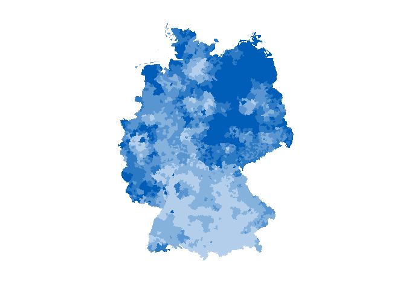
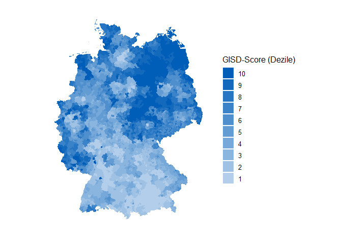
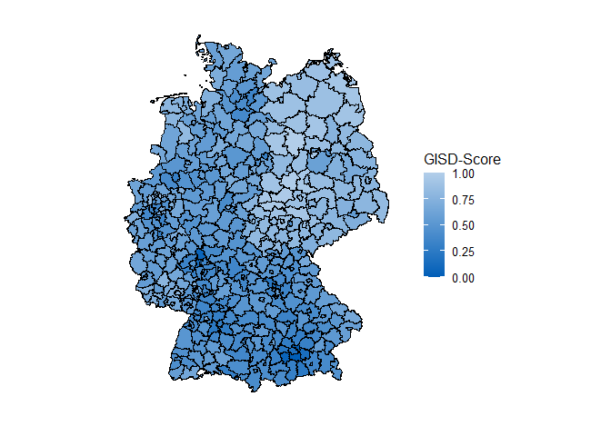
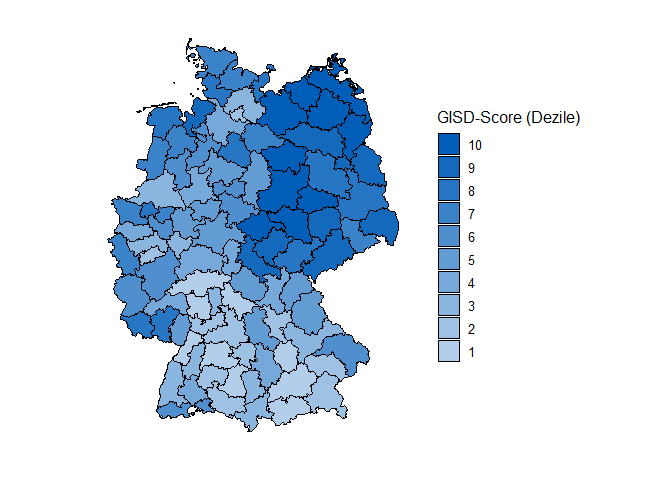

```r
#Kreise
GISD_data_Kreis <- read.csv("Outfiles/2022_v03/Bund/Kreis/Kreis.csv") %>% mutate(Kreis = Kreiskennziffer) %>% select(Kreis, GISD_Score, GISD_5, GISD_10) %>% distinct(Kreis, .keep_all = TRUE) %>% unique() %>% lazy_dt()

Kreise_data <- readRDS("Data/SHP/kreise_bkg.rds") %>% lazy_dt() %>% mutate(Kreis = as.numeric(id)) %>% select(-id) %>% left_join(GISD_data_Kreis, by = "Kreis") %>% lazy_dt()

Kreise_data <- as_tibble(Kreise_data)

Kreise_data <- Kreise_data %>% mutate(GISD_5 = case_when(GISD_5 == 1 ~ 5,
                                                         GISD_5 == 2 ~ 4,
                                                         GISD_5 == 3 ~ 3,
                                                         GISD_5 == 4 ~ 2,
                                                         GISD_5 == 5 ~ 1),
                                      GISD_10 = case_when(GISD_10 == 1 ~ 10,
                                                          GISD_10 == 2 ~ 9,
                                                          GISD_10 == 3 ~ 8,
                                                          GISD_10 == 4 ~ 7,
                                                          GISD_10 == 5 ~ 6,
                                                          GISD_10 == 6 ~ 5,
                                                          GISD_10 == 7 ~ 4,
                                                          GISD_10 == 8 ~ 3,
                                                          GISD_10 == 9 ~ 2,
                                                          GISD_10 == 10 ~ 1))


#Gemeinden
GISD_data_Gem <- read.csv("Outfiles/2022_v03/Bund/Gemeinde/Gemeinde.csv") %>% filter(Jahr == 2019) %>% select(Gemeindekennziffer, GISD_Score, GISD_5, GISD_10) %>% distinct(Gemeindekennziffer, .keep_all = TRUE) %>% unique()

sum(is.na(GISD_data_Gem$GISD_Score))
```

```
## [1] 0
```

```r
GISD_data_Kreis <- read.csv("Outfiles/2022_v03/Bund/Kreis/Kreis.csv") %>% filter(Jahr == 2019) %>% mutate(Kreis = Kreiskennziffer, GISD_Score_Kreis = GISD_Score, GISD_5_Kreis = GISD_5, GISD_10_Kreis = GISD_10) %>% select(Kreis, GISD_Score_Kreis, GISD_5_Kreis, GISD_10_Kreis) %>% distinct(Kreis, .keep_all = TRUE)

Gemeinden_data <- readRDS("Data/SHP/BRD_Gemeinden.rds") %>% mutate(Gemeindekennziffer = as.numeric(id)) %>% select(-id) %>% left_join(GISD_data_Gem, by = "Gemeindekennziffer") %>% mutate(Kreis = floor(Gemeindekennziffer / 1000), Kreis = case_when(Kreis == 3152 | Kreis == 3156 ~ 3159, Kreis != 3152 | Kreis != 3156 ~ Kreis)) %>% left_join(GISD_data_Kreis, by = "Kreis") %>% lazy_dt()

Gemeinden_data <- as_tibble(Gemeinden_data)


#sum(is.na(Gemeinden_data$GISD_Score))

Gemeinden_data <- Gemeinden_data %>% mutate(GISD_Score = ifelse(is.na(GISD_Score) == TRUE, GISD_Score_Kreis, GISD_Score), GISD_5 = ifelse(is.na(GISD_5) == TRUE, GISD_5_Kreis, GISD_5), GISD_10 = ifelse(is.na(GISD_10) == TRUE, GISD_10_Kreis, GISD_10)) %>% select(-Kreis, -GISD_Score_Kreis, -GISD_5_Kreis, -GISD_10_Kreis)

#sum(is.na(Gemeinden_data$GISD_Score))
#sum(is.na(Gemeinden_data$GISD_5))

#Gemeinden_data$Gemeindekennziffer[is.na(Gemeinden_data$GISD_Score)]

Gemeinden_data <- Gemeinden_data %>% mutate(GISD_5 = case_when(GISD_5 == 1 ~ 5,
                                                         GISD_5 == 2 ~ 4,
                                                         GISD_5 == 3 ~ 3,
                                                         GISD_5 == 4 ~ 2,
                                                         GISD_5 == 5 ~ 1),
                                            GISD_10 = case_when(GISD_10 == 1 ~ 10,
                                                          GISD_10 == 2 ~ 9,
                                                          GISD_10 == 3 ~ 8,
                                                          GISD_10 == 4 ~ 7,
                                                          GISD_10 == 5 ~ 6,
                                                          GISD_10 == 6 ~ 5,
                                                          GISD_10 == 7 ~ 4,
                                                          GISD_10 == 8 ~ 3,
                                                          GISD_10 == 9 ~ 2,
                                                          GISD_10 == 10 ~ 1))


#Länder
GISD_data_Lander <- read.csv("Outfiles/2022_v03/Bund/Raumordnungsregion/Raumordnungsregion.csv") %>% mutate(ROR_id = Raumordnungsregion.Nr) %>%  select(ROR_id, GISD_Score, GISD_5, GISD_10) %>% distinct(ROR_id, .keep_all = TRUE) %>% unique() %>% lazy_dt()

Lander_data <- readRDS("Data/SHP/ROR_map.rds") %>% lazy_dt() %>% mutate(ROR_id = as.numeric(id)) %>% select(-id) %>% left_join(GISD_data_Lander, by = "ROR_id") %>% lazy_dt()

Lander_data <- as_tibble(Lander_data)

Lander_data <- Lander_data %>% mutate(GISD_5 = case_when(GISD_5 == 1 ~ 5,
                                                         GISD_5 == 2 ~ 4,
                                                         GISD_5 == 3 ~ 3,
                                                         GISD_5 == 4 ~ 2,
                                                         GISD_5 == 5 ~ 1),
                                      GISD_10 = case_when(GISD_10 == 1 ~ 10,
                                                          GISD_10 == 2 ~ 9,
                                                          GISD_10 == 3 ~ 8,
                                                          GISD_10 == 4 ~ 7,
                                                          GISD_10 == 5 ~ 6,
                                                          GISD_10 == 6 ~ 5,
                                                          GISD_10 == 7 ~ 4,
                                                          GISD_10 == 8 ~ 3,
                                                          GISD_10 == 9 ~ 2,
                                                          GISD_10 == 10 ~ 1))


##Bula
Bula_data <- readRDS("Data/SHP/BRD_BuLa.rds")
```


## GISD-Score auf Gemeindeebene

```r
ggplot(Gemeinden_data, aes(long, lat, group = group, fill = GISD_Score)) +
  geom_polygon() +
  scale_fill_rki(palette = "main", name = "GISD-Score", discrete = FALSE) +
  coord_equal() +
  theme_rki_void()
```

<!-- -->

```r
#which(is.na(Gemeinden_data$GISD_Score))
```


```r
ggplot(Gemeinden_data, aes(long, lat, group = group, fill = as.factor(GISD_5))) +
  geom_polygon() +
  scale_fill_rki(palette = "main", guide="none") +
  coord_equal() +
  theme_rki_void()
```

<!-- -->


```r
ggplot(Gemeinden_data, aes(long, lat, group = group, fill = as.factor(GISD_10))) +
  geom_polygon() +
  scale_fill_rki(palette = "main", name = "GISD-Score (Dezile)", labels = c("10", "9", "8", "7", "6", "5", "4", "3", "2", "1")) +
  coord_equal() +
  theme_rki_void()
```

<!-- -->

## GISD-Score auf Kreisebene

```r
ggplot(Kreise_data, aes(long, lat, group = group, fill = GISD_Score)) +
  geom_polygon(color = "black") +
  scale_fill_rki(palette = "main", name = "GISD-Score", discrete = FALSE) +
  coord_equal() +
  theme_rki_void()
```

<!-- -->


```r
ggplot(Kreise_data, aes(long, lat, group = group, fill = as.factor(GISD_5))) +
  geom_polygon() +
  scale_fill_rki(palette = "main", guide="none") +
  coord_equal() +
  theme_rki_void()
```

<!-- -->


```r
ggplot(Kreise_data, aes(long, lat, group = group, fill = as.factor(GISD_10))) +
  geom_polygon(color = "black") +
  scale_fill_rki(palette = "main", name = "GISD-Score (Dezile)", labels = c("10", "9", "8", "7", "6", "5", "4", "3", "2", "1")) +
  coord_equal() +
  theme_rki_void()
```

<!-- -->

## GISD-Score nach Raumordnungsregion

```r
ggplot(Lander_data, aes(long, lat, group = group, fill = GISD_Score)) +
  geom_polygon(color = "black") +
  scale_fill_rki(palette = "main", name = "GISD-Score", discrete = FALSE) +
  coord_equal() +
  theme_rki_void()
```

<!-- -->


```r
ggplot(Lander_data, aes(long, lat, group = group, fill = as.factor(GISD_5))) +
  geom_polygon() +
  scale_fill_rki(palette = "main", name = "GISD-Score (Quintile)", labels = c("5", "4", "3", "2", "1")) +
  coord_equal() +
  theme_rki_void()
```

<!-- -->


```r
ggplot(Lander_data, aes(long, lat, group = group, fill = as.factor(GISD_10))) +
  geom_polygon(color = "black") +
  scale_fill_rki(palette = "main", name = "GISD-Score (Dezile)", labels = c("10", "9", "8", "7", "6", "5", "4", "3", "2", "1")) +
  coord_equal() +
  theme_rki_void()
```

<!-- -->
